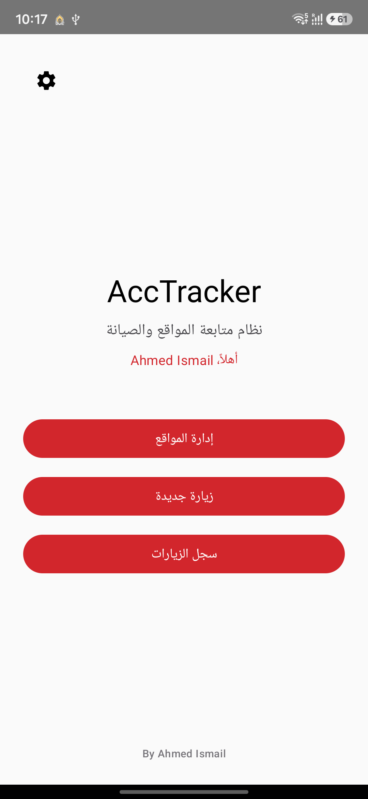
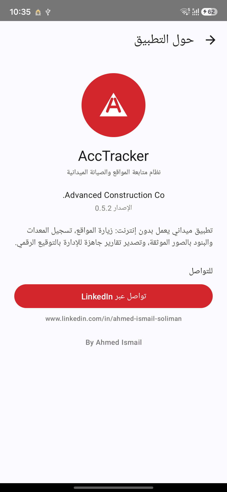

<div dir="rtl">

# AccTracker — نظام متابعة المواقع والصيانة الميدانية

**تطبيق أندرويد ميداني يعمل بدون إنترنت (Offline-First)** + **باك-إند ويب للمهندس** لاستيراد الزيارات وإدارة المواقع والمانوالات.

`Kotlin` · `Jetpack Compose` · `Room` · `CameraX` · `FastAPI` · `SQLite` · `PyMuPDF` · `FTS5` · `ECDSA P-256`

</div>

**AccTracker** is an offline-first field maintenance platform: a technician Android app (site visits, equipment, checklists, stamped photos, digitally signed export packages) plus an engineer web backend (package verification & import, hierarchy management, manuals with full-text search, and local-LLM maintenance rule extraction).

<div dir="rtl">

## ✨ المميزات

### 📱 تطبيق الفني (Android) — يعمل بالكامل بدون إنترنت
- **شجرة إدارية مرنة:** مشروع ← منطقة ← زون ← موقع، مع دعم تخطي المستويات الناقصة والزيارة على أي مستوى.
- **تدفق زيارة كامل:** اختيار الموقع → المعدات والقراءات → بنود الفحص → المراجعة → التصدير.
- **بنود مرنة:** حالة من قائمة منسدلة (سليم / ملاحظة / عطل) + ملاحظات + إضافة/تعديل/حذف بنود.
- **صور موثّقة:** كل صورة تُختم تلقائيًا بالتاريخ/الوقت + إحداثيات GPS + اسم الموقع + اسم الفني، مع بصمة SHA-256 وتوقيع التقاط.
- **إعادة استخدام المعدات:** زيارة جديدة لنفس الموقع تعرض معدات آخر زيارة تلقائيًا — وكل موقع معداته منفصلة تمامًا.
- **حزمة زيارة موقّعة رقميًا (ECDSA P-256)** مع **تقرير إدارة احترافي** جاهز للمشاركة (ورقة Report بدون أي أكواد تقنية).
- **سجل الزيارات:** استئناف المسودات + مشاركة الحزم والصور.

### 🌐 باك-إند المهندس (Web)
- استيراد الحزم الموقّعة بتحقق كامل (تجزئة/توقيع/تعارضات) ودمج Idempotent.
- إدارة شجرة المواقع وأكوادها (PRJ/RGN/ZN/LOC) ودورة «جديد من الميدان».
- **Manuals:** رفع PDF → استخراج نص → تقطيع → فهرسة FTS5 → بحث.
- **استخراج قواعد الصيانة** من المانوالات عبر LLM محلي (Ollama) بحالة DRAFT للاعتماد.

## 🧱 هيكل المستودع

| المجلد | الوصف |
|---|---|
| `android/` | تطبيق الفني — Kotlin + Jetpack Compose + Room + CameraX |
| `web/backend/` | باك-إند المهندس — FastAPI + SQLite (WAL) + Alembic |
| `contract/` | عقود حزمة الزيارة: Schemas + قوائم التحقق + عينات |
| `tools/` | `validate_package.py` (مصدر الحقيقة للتحقق) + أدوات التوقيع |
| `tests/` | فحوص العقود الشاملة |
| `ARCHITECTURE.md` | الوثيقة المرجعية الكاملة للمعمارية |

## 🔐 الأمان والموثوقية
- مفتاح توقيع فريد لكل جهاز (Android Keystore) — الحزم موقّعة ECDSA P-256.
- كل صورة تحمل بصمة SHA-256 + توقيع التقاط مستقل.
- تحقق إلزامي على كل حزمة: `python tools/validate_package.py <package.zip>`.
- لا فقدان لعمل الميدان: العناصر الواردة من الفنيين تُدمج وتُراجع ولا تُحذف صامتًا.

## 🚀 التشغيل السريع

### تطبيق الأندرويد
```bash
cd android
./gradlew :app:assembleDebug        # بناء APK
./gradlew :app:testDebugUnitTest    # فحوص الوحدة
```

### باك-إند الويب
```bash
cd web/backend
py -3.12 -m venv .venv
.venv/Scripts/python -m pip install -r requirements.txt
.venv/Scripts/python -m alembic upgrade head
.venv/Scripts/python -m uvicorn app.main:app --reload
.venv/Scripts/python -m pytest
```

## 📸 لقطات

| الشاشة الرئيسية | حول التطبيق |
|---|---|
|  |  |

## 🗺️ خارطة الطريق
- ☁️ **مزامنة سحابية تلقائية (Offline-First Sync)** — 🚧 قيد التنفيذ: تطبيق الأندرويد يرفع الحزم تلقائيًا لـ Firebase (Storage + Firestore)، والباك-إند يسحب ويستورد أولًا بأول (`/api/cloud/pull`).
- 🖥️ **واجهة ويب React للمهندس + تطبيق Desktop (EXE)** — ✅ مكتمل: لوحة المهندس (شجرة المواقع، الحزم المستوردة، المزامنة السحابية، بحث المانوالات) وتُحزَّم `AccTracker.exe` تشغّل اللوحة والخادم معًا للـLab.
- 🔎 **OCR للمانوالات الممسوحة ضوئيًا** — ✅ مكتمل: RapidOCR محلي بالكامل عند الرفع (صفحات بلا نص) + إعادة تشغيل عبر `POST /api/manuals/{id}/ocr` وتفكيك كلمات للبحث.

## 📬 التواصل
- **Ahmed Ismail** — [LinkedIn](https://www.linkedin.com/in/ahmed-ismail-soliman)

<div align="center">

© 2026 Advanced Construction Co. — جميع الحقوق محفوظة

</div>

</div>
